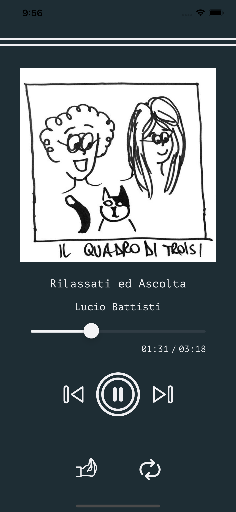
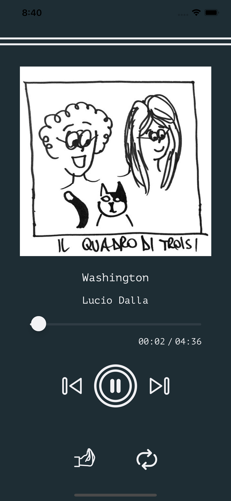
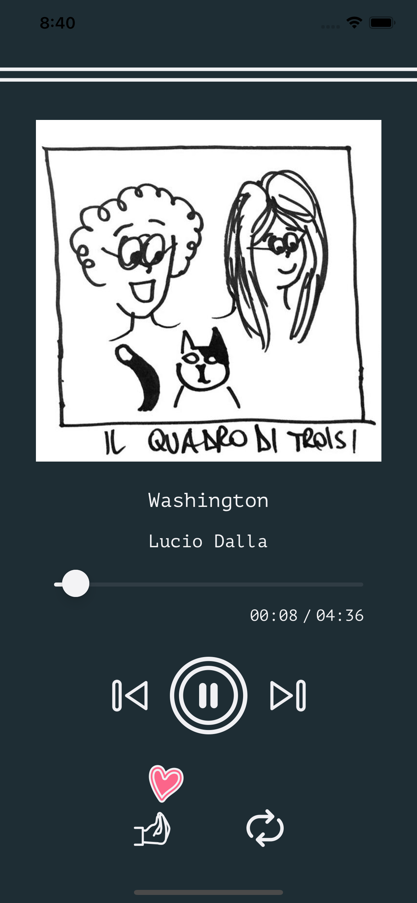

#  Radio Fonico

*Music for meriggiares.*

Music compilation by Beats in Space Radio

https://www.mixcloud.com/bisradio/bis-radio-show-1072-with-il-quadro-di-troisi-donato-dozzy-eva-geist/

TRACKLIST: 

1. Mango-Bella d’estate 
2. Lucio Dalla-Washington 
3. Franco Battiato-Summer on a Solitary Beach 
4. Lucio Battisti-Rilassati ed Ascolta 
5. Matia Bazar-Palestina-1983 Ariston
6. Krisma-Samora Club
7. Paolo Tofani-Un Altro Universo 
8. Alice-Chan-Son Egocentrique 
9. Giuni Russo-Buenos Aires
10. Enrico Ruggeri-Polvere CGD
11. Anna Oxa-Uragano e Nuvole 
12. Garbo-A Berlino Va Bene 
13. Righeira-Disco Volante 
14. Gaznevada-Agente Speciale 
15. Mike Francis-Survivor
16. Marcella Bella-Nell’Aria 
17. Teresa De Sio-Voglia E Turna
